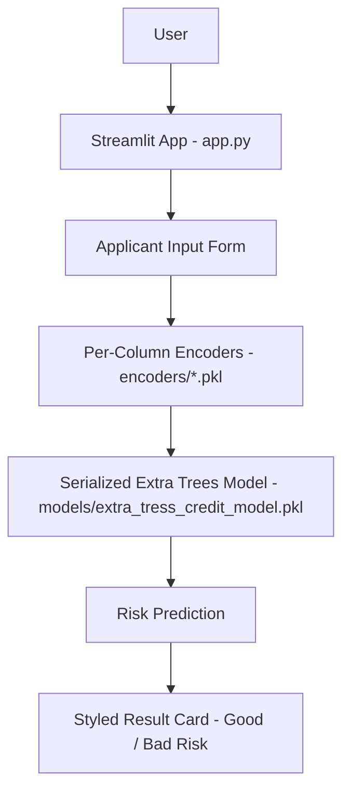
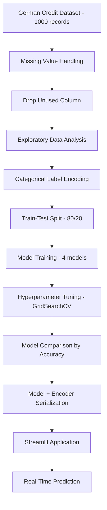
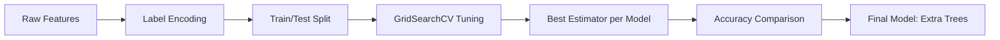

# 💳 Credit Risk Modeling

**An end-to-end machine learning system that classifies loan applicants as Good or Bad Credit Risk, deployed as an interactive Streamlit application.**


## Overview

Lenders need a fast, consistent way to gauge how risky a loan applicant is before extending credit. This project builds a classification pipeline on the German Credit dataset that predicts whether an applicant represents a **Good** or **Bad** credit risk from their demographic and financial attributes, and exposes that model through a live Streamlit web app. It's aimed at recruiters and engineers who want to see a complete, reproducible ML workflow — from raw data to a deployed, user-facing prediction tool — rather than just a notebook.

---

## 🚀 Project Overview

**Problem:** Manually assessing an applicant's credit risk from raw financial and demographic data is slow and inconsistent.

**Solution:** A trained classification model that takes applicant attributes (age, job, housing, savings, checking balance, credit amount, duration, purpose) and returns an instant Good/Bad risk prediction, served through a Streamlit interface.

**Target users:** Recruiters and engineers evaluating this as a portfolio project; the app itself is designed as a demo of how such a system would work in a lending workflow.

**Key value:** Turns a multi-step data science pipeline (cleaning → EDA → encoding → model selection → tuning) into a single-click prediction tool.

---

## 🎯 Objectives

- Clean and prepare the German Credit dataset for modeling
- Explore the data to understand risk-driving factors
- Encode categorical applicant attributes for machine learning
- Train and compare multiple classification models
- Select and serialize a final model for deployment
- Provide an interactive Streamlit interface for real-time predictions

---

## ✨ Key Features

### Core Features
- Data cleaning and missing-value handling on the German Credit dataset
- Categorical feature encoding with persisted `LabelEncoder` objects per column
- Multi-model training and comparison with hyperparameter tuning

### ML/AI Features
- Four classification models evaluated: Decision Tree, Random Forest, Extra Trees, XGBoost
- Hyperparameter search via `GridSearchCV` with 5-fold cross-validation
- Serialized final model and encoders (`joblib`) loaded directly by the app

### User Interface Features
- Two-column Streamlit form for applicant and loan details
- Custom CSS styling with a background image, card layout, and color-coded result banner (green for Good Risk, red for Bad Risk)

### Engineering Features
- Clean separation of `data/`, `models/`, and `encoders/` artifacts
- Reproducible pipeline notebook (`analysis_model.ipynb`) covering the full workflow
- Version-controlled with Git

---

## 🏗️ System Architecture



- **Streamlit App (`app.py`):** Renders the UI, applies custom styling, and orchestrates encoding + prediction.
- **Applicant Input Form:** Collects age, sex, job, housing, savings, checking account, credit amount, duration, and purpose.
- **Encoders:** Five saved `LabelEncoder` objects (`Sex`, `Housing`, `Saving accounts`, `Checking account`, `Purpose`) transform categorical inputs into the numeric format the model expects.
- **Model:** A pre-trained Extra Trees classifier (`extra_tress_credit_model.pkl`) makes the prediction.
- **Result Card:** Displays a color-coded verdict directly in the app.

---

## 🔄 Project Workflow



---

## 🧠 Machine Learning Pipeline

1. **Dataset:** German Credit dataset (1,000 raw records, 11 columns)
2. **Features:** `Age`, `Sex`, `Job`, `Housing`, `Saving accounts`, `Checking account`, `Credit amount`, `Duration`, `Purpose`
3. **Target variable:** `Risk` (`good` / `bad`)
4. **Preprocessing:** Dropped rows with missing `Saving accounts` / `Checking account` values; removed the unused index column
5. **Encoding:** `LabelEncoder` applied to all categorical features and the target, each encoder saved individually
6. **Feature engineering:** None beyond encoding — the nine raw attributes are used directly
7. **Train/Test split:** 80/20 stratified split (417 train / 105 test samples)
8. **Models trained:** Decision Tree, Random Forest, Extra Trees, XGBoost
9. **Evaluation metric:** Accuracy on the held-out test set
10. **Model selection:** Extra Trees was tuned and serialized as the model used by the app (see note in [Models Used](#-models-used) on how it compares to XGBoost)
11. **Serialization:** Final model and all encoders saved with `joblib`
12. **Prediction pipeline:** App inputs → per-column encoding → model inference → risk label



---

## 🤖 Models Used

| Model | Purpose | Evaluation Metric | Result |
|---|---|---|---|
| Decision Tree | Baseline classifier | Test Accuracy | 59.05% |
| Random Forest | Ensemble comparison | Test Accuracy | 63.81% |
| **Extra Trees** | **Final deployed model** | **Test Accuracy** | **65.71%** |
| XGBoost | Ensemble comparison | Test Accuracy | 73.33% |

**Note:** XGBoost scored highest on test accuracy (73.33%) in the comparison, but the model serialized and loaded by the Streamlit app is Extra Trees (65.71%). The notebook does not document a stated reason for this choice — flagged here rather than assumed, and a clear candidate for the [Future Improvements](#-future-improvements) list.

All models were tuned with `GridSearchCV` (5-fold cross-validation, scoring on accuracy).

---

## 📊 Exploratory Data Analysis

- **Dataset size:** 1,000 original records → 522 after dropping rows with missing `Saving accounts` or `Checking account` values
- **Class balance (post-cleaning):** Good Risk 291 / Bad Risk 231 (≈55.7% / 44.3%)
- **Numerical features examined:** `Age`, `Credit amount`, `Duration` — distributions and boxplots reviewed, including applicants with `Duration >= 60` months as outliers
- **Correlation:** `Credit amount` and `Duration` show the strongest correlation among numeric features (0.61); `Age` correlates weakly with the others
- **Business-level patterns:** Average `Credit amount` rises with `Job` category and is higher for male applicants than female applicants in this dataset; bad-risk applicants have on average higher `Credit amount` and longer `Duration` than good-risk applicants
- **Categorical breakdowns:** `Sex`, `Job`, `Housing`, `Saving accounts`, `Checking account`, and `Purpose` were each plotted against `Risk` to inspect class patterns

---

## 🖥️ Application Preview

### Home / Input Interface

Two-column form for entering applicant details and loan details, styled with a dark themed background.

### Good Credit Risk Result

Green result card shown when the model predicts a lower-risk applicant.

### Bad Credit Risk Result

Red result card shown when the model predicts a higher-risk applicant.

---

## 📈 Results

- Four classification models were trained and tuned under identical cross-validation settings for a fair comparison.
- XGBoost achieved the highest held-out accuracy (73.33%); Extra Trees (65.71%) is the model currently wired into the deployed app.
- Predictions are returned instantly through the Streamlit interface with a clear visual (green/red) verdict, making the output usable by a non-technical end user.

---

## 🛠️ Tech Stack

| Category | Technology |
|---|---|
| Language | Python |
| Data Processing | Pandas, NumPy |
| Visualization | Matplotlib, Seaborn |
| Machine Learning | Scikit-learn, XGBoost |
| Frontend | Streamlit |
| Model Persistence | Joblib |
| Development | Jupyter Notebook |
| Version Control | Git / GitHub |

---

## 📁 Project Structure

```text
Credit Risk Modeling/
│
├── app.py                          # Streamlit application
├── analysis_model.ipynb            # Full data prep, EDA, and modeling pipeline
├── requirements.txt                # Python dependencies
│
├── data/
│   └── german_credit_data.csv      # German Credit dataset
│
├── models/
│   └── extra_tress_credit_model.pkl  # Serialized final model
│
├── encoders/
│   ├── Sex_encoder.pkl
│   ├── Housing_encoder.pkl
│   ├── Saving accounts_encoder.pkl
│   ├── Checking account_encoder.pkl
│   ├── Purpose_encoder.pkl
│   └── target_encoder.pkl
│
└── Project Images/                 # Screenshots used in this README
    ├── App Dashboard Image.jpg
    ├── Bad Credit Risk.jpg
    ├── Good Credit Risk.jpg
    ├── credit_risk_background.webp.webp
    ├── Project Structure Credit Risk Pipeline.png
    ├── PROJECT STRUCTURE IMAGE.png
    └── WORK FLOW OF PROJECT.png
```

---

## ⚙️ Installation & Setup

### Clone Repository

```bash
git clone https://github.com/harshantla-cloud/CREDIT-RISK-MODELLING.git
cd CREDIT-RISK-MODELLING
```

### Create Virtual Environment

```bash
python -m venv venv
```

### Activate Environment

**Windows**
```bash
venv\Scripts\activate
```

**Linux/macOS**
```bash
source venv/bin/activate
```

### Install Dependencies

```bash
pip install -r requirements.txt
```

### Run the App

```bash
streamlit run app.py
```

---

## Live Demo

[Credit Risk Modeling — Live Demo](https://harsh-credit-risk.streamlit.app/)

---

## 🔮 Future Improvements

- Resolve the model-selection gap by deploying XGBoost (higher test accuracy) or documenting why Extra Trees was chosen instead
- Add model explainability (e.g. SHAP or feature importance) to the app
- Report additional evaluation metrics (precision, recall, F1, ROC-AUC) alongside accuracy
- Add input validation and error handling in the Streamlit form
- Add automated tests and a CI pipeline

---

## Author

**Harsh**
B.Tech, Computer Science & Engineering (2023–2027)
Focus: Data Science, Machine Learning, AI, Deep Learning

[GitHub](https://github.com/harshantla-cloud) · [LinkedIn](https://linkedin.com/in/harsh-5694b13ab) 
[Live Demo](https://harsh-credit-risk.streamlit.app/)