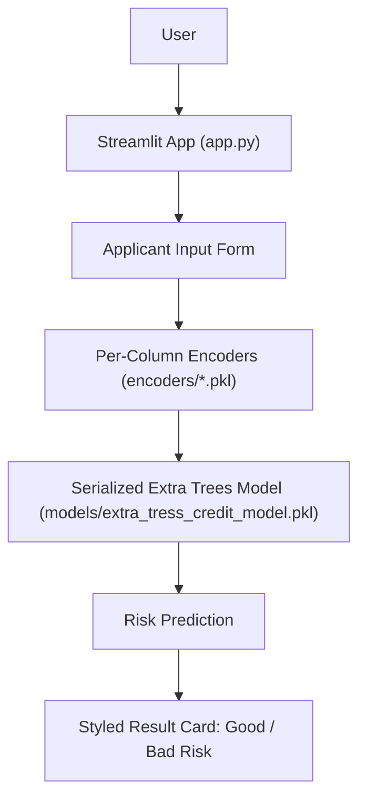
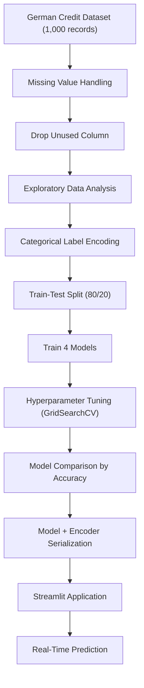
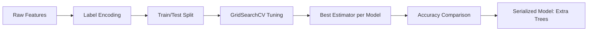

# 💳 Credit Risk Modelling

**An end-to-end machine learning system that classifies loan applicants as Good or Bad credit risk, served through a live Streamlit application.**

[](https://github.com/harshantla-cloud/CREDIT-RISK-MODELLING)
[](https://www.python.org/)
[](https://harsh-credit-risk.streamlit.app/)
[](https://scikit-learn.org/)
[](https://xgboost.ai/)

**[🔗 Live Demo](https://harsh-credit-risk.streamlit.app/)**

Credit risk assessment from raw applicant data is slow and inconsistent when done by hand. This project trains and compares four classifiers on the German Credit dataset to predict whether an applicant is a **Good** or **Bad** risk from nine demographic and financial attributes. The final model is serialized and exposed through a Streamlit interface that returns an instant, color-coded verdict. It demonstrates a complete, reproducible workflow from raw data to a deployed prediction tool.

---

## 🚀 Project Overview

| | |
|---|---|
| **Problem** | Judging an applicant's credit risk from raw financial and demographic attributes is time-consuming and subjective. |
| **Solution** | A tuned classification model that takes applicant attributes and returns a Good/Bad risk prediction in real time. |
| **Target users** | Lending analysts and credit-screening workflows (the app is a demonstration of such a system). |
| **Use case** | First-pass screening of loan applications based on age, job, housing, savings, checking balance, credit amount, duration, and purpose. |
| **Key value** | Packages a multi-step data science pipeline (cleaning → EDA → encoding → model comparison → tuning) into a single prediction interface. |

---

## 🎯 Objectives

- Clean and prepare the German Credit dataset for modeling
- Explore the data to understand factors associated with credit risk
- Encode categorical applicant attributes for machine learning
- Train and compare multiple classification models with hyperparameter tuning
- Serialize a final model and its encoders for deployment
- Provide an interactive interface for real-time predictions

---

## ✨ Key Features

### Core Features
- Missing-value handling on the German Credit dataset
- Per-column `LabelEncoder` objects persisted for reuse at inference time
- Multi-model training and comparison

### ML/AI Features
- Four classifiers evaluated: Decision Tree, Random Forest, Extra Trees, XGBoost
- Hyperparameter search with `GridSearchCV` (5-fold cross-validation, accuracy scoring)
- Model and encoders serialized with `joblib` and loaded directly by the app

### User Interface Features
- Two-column Streamlit form for applicant and loan details
- Custom CSS with a background image, card layout, and a color-coded result banner (green = Good Risk, red = Bad Risk)

### Engineering Features
- Artifacts separated into `data/`, `models/`, and `encoders/`
- Full pipeline documented in a single notebook (`analysis_model.ipynb`)
- Version-controlled with Git and deployed on Streamlit

---

## 🏗️ System Architecture



| Component | Role |
|---|---|
| **Streamlit app (`app.py`)** | Renders the UI, applies custom styling, orchestrates encoding and prediction. |
| **Input form** | Collects age, sex, job, housing, savings, checking account, credit amount, duration, and purpose. |
| **Encoders** | Saved `LabelEncoder` objects (`Sex`, `Housing`, `Saving accounts`, `Checking account`, `Purpose`) convert categorical inputs to the numeric format the model expects. |
| **Model** | Pre-trained Extra Trees classifier that produces the prediction. |
| **Result card** | Displays the verdict as a green or red banner. |

---

## 🔄 Project Workflow



---

## 🧠 Machine Learning Pipeline

| Stage | Detail |
|---|---|
| **Dataset** | German Credit dataset: 1,000 raw records, 11 columns |
| **Features** | `Age`, `Sex`, `Job`, `Housing`, `Saving accounts`, `Checking account`, `Credit amount`, `Duration`, `Purpose` |
| **Target** | `Risk` (`good` / `bad`) |
| **Preprocessing** | Dropped rows with missing `Saving accounts` / `Checking account`; removed the unused index column |
| **Encoding** | `LabelEncoder` on all categorical features and the target; each encoder saved individually |
| **Feature engineering** | None beyond encoding; the nine raw attributes are used directly |
| **Train/test split** | 80/20 stratified (417 train / 105 test samples) |
| **Models** | Decision Tree, Random Forest, Extra Trees, XGBoost |
| **Metric** | Accuracy on the held-out test set |
| **Serialization** | Final model and encoders saved with `joblib` |
| **Prediction pipeline** | App inputs → per-column encoding → model inference → risk label |



---

## 🤖 Models Used

| Model | Purpose | Metric | Test Accuracy |
|---|---|---|---|
| Decision Tree | Baseline classifier | Accuracy | 59.05% |
| Random Forest | Ensemble comparison | Accuracy | 63.81% |
| **Extra Trees** | **Model currently deployed in the app** | Accuracy | **65.71%** |
| XGBoost | Ensemble comparison | Accuracy | 73.33% |

> **Model-selection note:** XGBoost scored highest on the held-out test set (73.33%), but the model serialized and loaded by the app is Extra Trees (65.71%). No rationale for this choice is documented in the notebook, so it is flagged here rather than assumed. See [Future Improvements](#-future-improvements).

All models were tuned with `GridSearchCV` (5-fold CV, accuracy scoring). The test set contains 105 samples, so differences of a few points correspond to only a handful of predictions.

---

## 📊 Exploratory Data Analysis

- **Dataset size:** 1,000 records → 522 after removing rows with missing `Saving accounts` or `Checking account`
- **Class balance (post-cleaning):** Good Risk 291 / Bad Risk 231 (≈ 55.7% / 44.3%)
- **Numerical features:** `Age`, `Credit amount`, `Duration`; distributions and boxplots reviewed, with applicants at `Duration >= 60` months treated as outliers
- **Correlation:** `Credit amount` and `Duration` show the strongest numeric correlation (0.61); `Age` is weakly correlated with the others
- **Patterns:**
  - Average `Credit amount` rises with `Job` category and is higher for male than female applicants in this dataset
  - Bad-risk applicants have, on average, higher `Credit amount` and longer `Duration` than good-risk applicants
- **Categorical breakdowns:** `Sex`, `Job`, `Housing`, `Saving accounts`, `Checking account`, and `Purpose` were each plotted against `Risk`

---

## 🖥️ Application Preview

### Home / Input Interface


Two-column form for applicant and loan details on a dark themed background.

### Good Credit Risk Result


Green result card shown when the model predicts a lower-risk applicant.

### Bad Credit Risk Result


Red result card shown when the model predicts a higher-risk applicant.

---

## 📈 Results

| Model | Test Accuracy |
|---|---|
| Decision Tree | 59.05% |
| Random Forest | 63.81% |
| Extra Trees (deployed) | 65.71% |
| XGBoost (best in comparison) | 73.33% |

- Four models were tuned under identical cross-validation settings, so the comparison is like-for-like.
- XGBoost achieved the highest accuracy; Extra Trees is the model wired into the app.
- Only accuracy is reported. Precision, recall, F1, and ROC-AUC are not specified.
- The app returns predictions instantly with a green/red verdict readable by a non-technical user.

---

## 🛠️ Tech Stack

| Category | Technology |
|---|---|
| Language | Python |
| Data Processing | Pandas, NumPy |
| Visualization | Matplotlib, Seaborn |
| Machine Learning | Scikit-learn, XGBoost |
| Frontend | Streamlit |
| Model Persistence | Joblib |
| Development | Jupyter Notebook |
| Version Control | Git / GitHub |

---

## 📁 Project Structure

```text
CREDIT-RISK-MODELLING/
│
├── app.py                              # Streamlit application
├── analysis_model.ipynb                # Data prep, EDA, and modeling pipeline
├── requirements.txt                    # Python dependencies
├── README.md
│
├── data/
│   └── german_credit_data.csv          # German Credit dataset
│
├── models/
│   └── extra_tress_credit_model.pkl    # Serialized deployed model
│
├── encoders/
│   ├── Sex_encoder.pkl
│   ├── Housing_encoder.pkl
│   ├── Saving accounts_encoder.pkl
│   ├── Checking account_encoder.pkl
│   ├── Purpose_encoder.pkl
│   └── target_encoder.pkl
│
└── Project Images/                     # Screenshots and app assets
```

---

## ⚙️ Installation & Setup

```bash
# Clone the repository
git clone https://github.com/harshantla-cloud/CREDIT-RISK-MODELLING.git
cd CREDIT-RISK-MODELLING

# Create and activate a virtual environment
python -m venv venv
venv\Scripts\activate          # Windows
# source venv/bin/activate     # Linux / macOS

# Install dependencies
pip install -r requirements.txt

# Run the app
streamlit run app.py
```

The app opens at `http://localhost:8501` by default.

---

## 🔮 Future Improvements

- Resolve the model-selection gap: deploy XGBoost (higher test accuracy) or document why Extra Trees was chosen
- Report precision, recall, F1, and ROC-AUC alongside accuracy
- Add model explainability (feature importance or SHAP) to the app
- Add input validation and error handling to the Streamlit form
- Add automated tests and a CI pipeline

---

## 👤 Author

**Harsh** · B.Tech, Computer Science & Engineering (2023–2027)
Focus: Data Science, Machine Learning, AI, Deep Learning

[GitHub](https://github.com/harshantla-cloud) · [LinkedIn](https://linkedin.com/in/harsh-5694b13ab) · [Live Demo](https://harsh-credit-risk.streamlit.app/)
