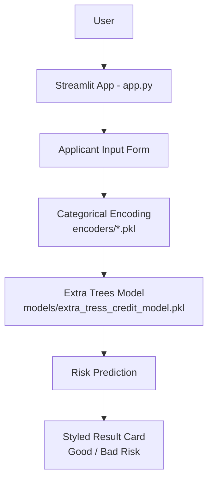
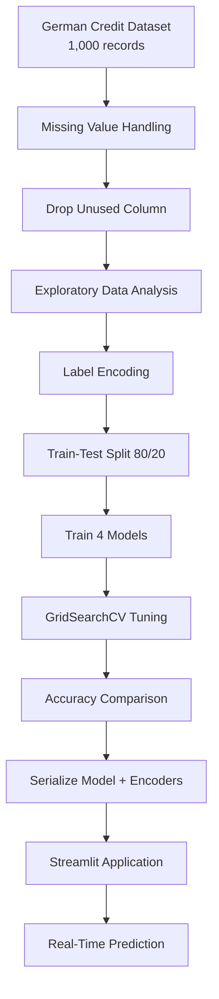
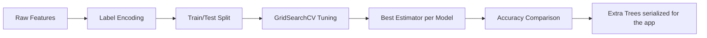

<div align="center">

# 💳 Credit Risk Modelling

**An end-to-end machine learning system that classifies loan applicants as *Good* or *Bad* credit risk, served through an interactive Streamlit application.**

[](https://github.com/harshantla-cloud/CREDIT-RISK-MODELLING)


[**🔗 Live Demo**](https://harsh-credit-risk.streamlit.app/) · [Application Preview](#️-application-preview) · [Results](#-results) · [Setup](#️-installation--setup)

</div>

---

Lenders need a fast, consistent way to gauge the risk of a loan applicant before extending credit. This project trains and compares four classification models on the German Credit dataset to predict whether an applicant is a **Good** or **Bad** credit risk from demographic and financial attributes, and exposes the trained model through a Streamlit web app for instant predictions.

---

## 🚀 Project Overview

| | |
|---|---|
| **Problem** | Assessing credit risk manually from raw applicant data is slow and inconsistent. |
| **Solution** | A tuned tree-based classifier that takes nine applicant attributes and returns a Good/Bad risk verdict in real time. |
| **Target users** | Loan officers / analysts (as a decision-support demo); recruiters and engineers reviewing this as a portfolio project. |
| **Use case** | Pre-screening loan applications in a lending workflow. |
| **Key value** | Packages a full pipeline (cleaning → EDA → encoding → model comparison → tuning → deployment) into a single-click prediction tool. |

## 🎯 Objectives

- Clean and prepare the German Credit dataset for modelling
- Explore the data to understand factors associated with credit risk
- Encode categorical applicant attributes for machine learning
- Train and compare multiple classification models with hyperparameter tuning
- Serialize the final model and encoders for reuse
- Provide an interactive Streamlit interface for real-time predictions

## ✨ Key Features

### Core Features
- Missing-value handling and cleaning of the German Credit dataset
- Per-column `LabelEncoder` objects, persisted and reused at inference time

### ML Features
- Four classifiers compared: Decision Tree, Random Forest, Extra Trees, XGBoost
- Hyperparameter search with `GridSearchCV` (5-fold cross-validation)
- Model and encoders serialized with `joblib`

### User Interface Features
- Two-column Streamlit form for applicant and loan details
- Custom-styled UI: background image, card layout, and a colour-coded result banner (green = Good Risk, red = Bad Risk)

### Engineering Features
- Artifacts separated into `data/`, `models/`, and `encoders/`
- Full reproducible workflow in a single notebook (`analysis_model.ipynb`)
- Publicly deployed on Streamlit Community Cloud

---

## 🏗️ System Architecture



| Component | Description |
|---|---|
| **Streamlit App (`app.py`)** | Renders the UI, applies custom CSS, and orchestrates encoding and prediction. |
| **Input Form** | Collects age, sex, job, housing, saving account, checking account, credit amount, duration, and loan purpose. |
| **Encoders** | Five saved `LabelEncoder` objects (`Sex`, `Housing`, `Saving accounts`, `Checking account`, `Purpose`) convert categorical inputs to the numeric format the model was trained on. |
| **Model** | Pre-trained Extra Trees classifier loaded with `joblib`; `Age`, `Job`, `Credit amount`, and `Duration` are passed as numeric values. |
| **Result Card** | Displays a green "Good Credit Risk" or red "Bad Credit Risk" banner. |

---

## 🔄 Project Workflow



---

## 🧠 Machine Learning Pipeline

| Stage | Detail |
|---|---|
| **Dataset** | German Credit dataset — 1,000 raw records, 11 columns (`data/german_credit_data.csv`) |
| **Features** | `Age`, `Sex`, `Job`, `Housing`, `Saving accounts`, `Checking account`, `Credit amount`, `Duration`, `Purpose` |
| **Target** | `Risk` (`good` / `bad`) |
| **Preprocessing** | Dropped rows with missing `Saving accounts` / `Checking account`; removed the unused index column |
| **Encoding** | `LabelEncoder` on categorical features and target; each encoder saved individually |
| **Feature engineering** | None beyond encoding — the nine raw attributes are used directly |
| **Train/Test split** | 80/20 split (417 train / 105 test samples) |
| **Models** | Decision Tree, Random Forest, Extra Trees, XGBoost |
| **Tuning** | `GridSearchCV`, 5-fold CV, accuracy scoring |
| **Evaluation metric** | Accuracy on the held-out test set |
| **Serialization** | `joblib` (model + encoders) |
| **Inference** | Form inputs → per-column encoding → model prediction → risk label |



---

## 🤖 Models Used

| Model | Purpose | Evaluation Metric | Result |
|---|---|---|---|
| Decision Tree | Baseline classifier | Test accuracy | 59.05% |
| Random Forest | Ensemble comparison | Test accuracy | 63.81% |
| **Extra Trees** | **Model deployed in the app** | Test accuracy | **65.71%** |
| XGBoost | Ensemble comparison | Test accuracy | 73.33% |

> **Model selection note:** XGBoost achieved the highest test accuracy (73.33%), but the model serialized and loaded by the app is Extra Trees (65.71%). The notebook does not document a reason for this choice, so none is claimed here. Switching the deployed model to XGBoost is listed under [Future Improvements](#-future-improvements).

---

## 📊 Exploratory Data Analysis

- **Dataset size:** 1,000 records → 522 after dropping rows with missing `Saving accounts` or `Checking account`
- **Class balance (after cleaning):** Good 291 / Bad 231 (≈ 55.7% / 44.3%)
- **Numeric features examined:** `Age`, `Credit amount`, `Duration` — distributions and boxplots, with applicants at `Duration ≥ 60` months treated as outliers
- **Correlation:** `Credit amount` and `Duration` are the most strongly correlated numeric pair (0.61); `Age` is weakly correlated with both
- **Patterns observed:** Average `Credit amount` rises with `Job` category and is higher for male than female applicants in this dataset; bad-risk applicants have, on average, higher `Credit amount` and longer `Duration`
- **Categorical breakdowns:** `Sex`, `Job`, `Housing`, `Saving accounts`, `Checking account`, and `Purpose` each plotted against `Risk`

---

## 🖥️ Application Preview

### Home / Input Interface


*Two-column form for applicant and loan details on a dark themed background.*

### Good Credit Risk Result


*Green result card shown when the model predicts a lower-risk applicant.*

### Bad Credit Risk Result


*Red result card shown when the model predicts a higher-risk applicant.*

---

## 📈 Results

| Model | Test Accuracy |
|---|---|
| Decision Tree | 59.05% |
| Random Forest | 63.81% |
| Extra Trees *(deployed)* | 65.71% |
| **XGBoost** *(best in comparison)* | **73.33%** |

- All four models were tuned under identical cross-validation settings (`GridSearchCV`, 5-fold).
- The held-out test set is small (105 samples), so differences of a few points should be interpreted cautiously.
- Only accuracy is reported; precision, recall, F1, and ROC-AUC are not part of the current evaluation.
- The app returns a binary verdict instantly, with a colour-coded output usable by a non-technical user.

---

## 🛠️ Tech Stack

| Category | Technology |
|---|---|
| Language | Python |
| Data Processing | Pandas, NumPy |
| Visualization | Matplotlib, Seaborn |
| Machine Learning | Scikit-learn, XGBoost |
| Frontend | Streamlit |
| Model Persistence | Joblib |
| Development | Jupyter Notebook |
| Deployment | Streamlit Community Cloud |
| Version Control | Git / GitHub |

---

## 📁 Project Structure

```
CREDIT-RISK-MODELLING/
│
├── app.py                              # Streamlit application
├── analysis_model.ipynb                # Data prep, EDA, modelling, tuning
├── requirements.txt                    # Python dependencies
├── README.md
│
├── data/
│   └── german_credit_data.csv          # German Credit dataset
│
├── models/
│   └── extra_tress_credit_model.pkl    # Serialized Extra Trees model
│
├── encoders/                           # Fitted LabelEncoders (.pkl)
│   ├── Sex_encoder.pkl
│   ├── Housing_encoder.pkl
│   ├── Saving accounts_encoder.pkl
│   ├── Checking account_encoder.pkl
│   ├── Purpose_encoder.pkl
│   └── target_encoder.pkl
│
└── Project Images/                     # Screenshots and app background
```

---

## ⚙️ Installation & Setup

### Clone Repository
```bash
git clone https://github.com/harshantla-cloud/CREDIT-RISK-MODELLING.git
cd CREDIT-RISK-MODELLING
```

### Create and Activate a Virtual Environment
```bash
python -m venv venv

# Windows
venv\Scripts\activate

# Linux / macOS
source venv/bin/activate
```

### Install Dependencies
```bash
pip install -r requirements.txt
```

### Run the App
```bash
streamlit run app.py
```

The app opens at `http://localhost:8501`. A hosted version is available at the [live demo](https://harsh-credit-risk.streamlit.app/).

---

## ⚠️ Limitations

- Trained on a small dataset (522 records after cleaning); the model is a demonstration, not a production lending system.
- The `Job` field is entered as the dataset's numeric code (0–3) in the UI.
- The deployed model is not the highest-scoring model in the comparison.

## 🔮 Future Improvements

- Deploy XGBoost (highest test accuracy) or document why Extra Trees is preferred
- Add precision, recall, F1, and ROC-AUC alongside accuracy
- Add model explainability (e.g. SHAP or feature importance) to the app
- Replace the numeric `Job` input with descriptive labels
- Add input validation, automated tests, and a CI pipeline

---

## 👤 Author

**Harsh** — B.Tech, Computer Science & Engineering (2023–2027)
Focus: Data Science, Machine Learning, AI, Deep Learning

[GitHub](https://github.com/harshantla-cloud) · [LinkedIn](https://linkedin.com/in/harsh-5694b13ab) · [Live Demo](https://harsh-credit-risk.streamlit.app/)
